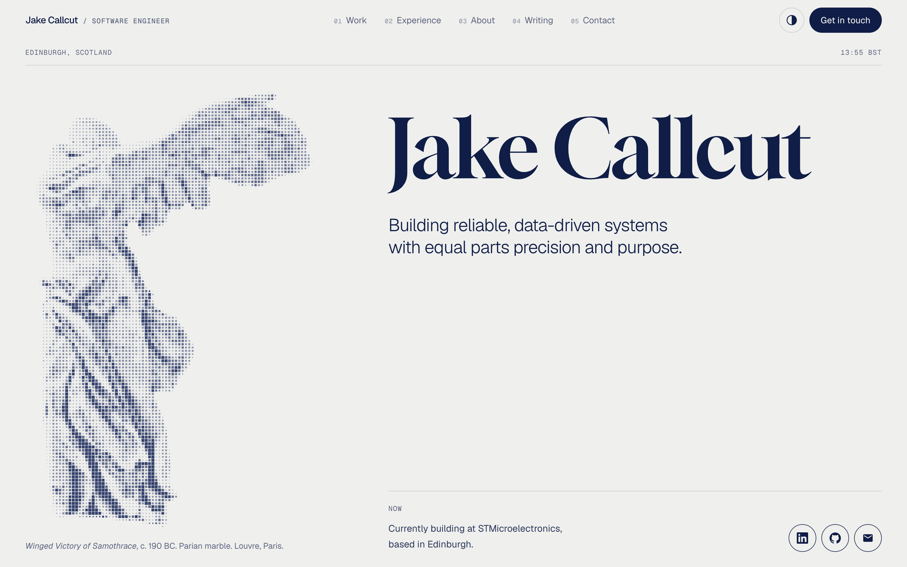
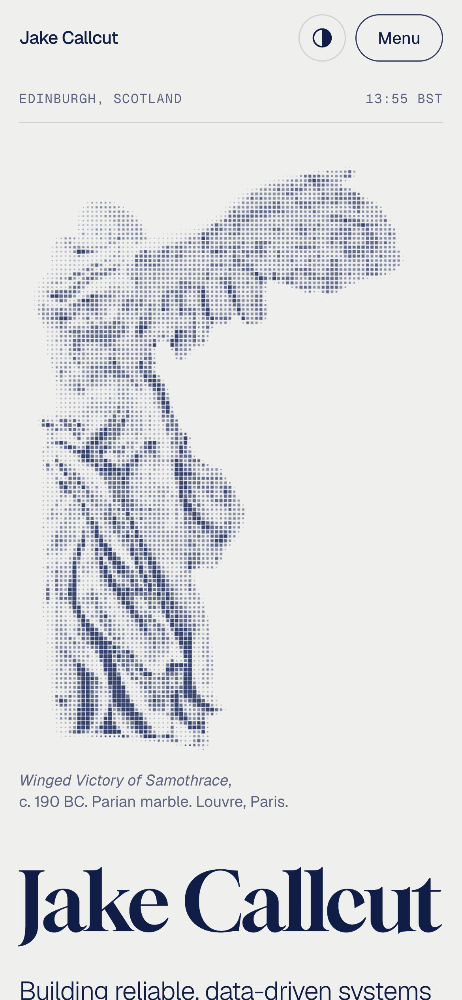

# Jake Callcut — Personal Portfolio

Live: https://jakecallcut.dev


A one-page, editorial portfolio built with React, TypeScript, Vite and Tailwind CSS. Paper and navy palette, Gloock headlines, and an interactive halftone of the Winged Victory of Samothrace whose dots part around the cursor.



## Getting started

```bash
npm ci          # install dependencies
npm run dev     # start the dev server at http://localhost:5173
npm test        # run the test suite (Vitest + Testing Library)
npm run lint    # lint with ESLint
npm run build   # type-check and build to dist/
npm run preview # serve the production build locally
```

## Editing content

- **Profile content**: hero text, the "Now" line, social links, experience, education, skills, projects and contact details all live in [`src/data/content.json`](src/data/content.json). Projects with `"featured": true` get a large card; the rest appear in the archive list.
- **Writing**: each post is a markdown file in [`src/content/writing/`](src/content/writing) with `title`, `date` and `description` frontmatter. Add new posts to [`public/sitemap.xml`](public/sitemap.xml) as well.
- **CV**: the download links point at `public/Jake_Callcut.pdf` (set in [`src/lib/sections.ts`](src/lib/sections.ts)).
- **Link preview**: `public/og-image.png` is the 1200×630 card shown when the site is shared.

## Design system

- **Colour**: theme tokens are CSS variables at the top of [`src/styles/globals.css`](src/styles/globals.css), defined once for light (`:root`) and once for dark (`.dark`). `--statue` tints the halftone artwork and `--tint` sets the navy duotone on project images. Tailwind v4 is configured in that same file (no `tailwind.config`).
- **Type**: Gloock for display headings, Geist for body text and Geist Mono for small labels, all self-hosted via Fontsource. The hero name is fitted to its column with container query units (`.fit-name`).
- **Theme**: light or dark follows the visitor's system setting until they use the toggle, which is remembered. An inline script in `index.html` applies it before first paint.
- **Motion**: sections fade up as they scroll into view, and everything respects `prefers-reduced-motion`.

## Halftone artwork

[`HalftoneArt`](src/components/HalftoneArt.tsx) renders a halftone SVG as particles on a canvas: dots drift away from the cursor and spring back, a click or tap sends a ripple through them, and the artwork sweeps in from the bottom the first time it scrolls into view. With reduced motion it is drawn still, and without canvas support it falls back to the plain SVG.

To add a piece:

1. Put light and dark versions in `public/images/`. Each SVG should be a few `<path>`s (one per `fill-opacity`) made of square (`M x y h s v s h-s z`) or round (`M x y a r r 0 1 0 2r 0 …`) dots.
2. Add an entry to [`src/lib/artworks.ts`](src/lib/artworks.ts) with both sources and alt text.
3. Render it inside a sized box: `<HalftoneArt art={MY_ART} align="left" className="absolute inset-0 size-full" />`. `align` picks the bottom corner it anchors to.

The astrolabe of ʿUmar ibn Yusuf is already defined there, ready to use.

## Structure

```text
src/
  App.tsx               routes, header, footer, scroll handling
  components/
    sections/           Hero, Work, Experience, About, Writing, Contact
    HalftoneArt.tsx     interactive halftone canvas
    Header.tsx          nav with active-section highlighting and mobile menu
    ...
  content/writing/      markdown posts
  data/content.json     site content
  lib/                  theme, SEO, writing loader, artworks, section list
  routes/               Home, Writing, WritingPost, NotFound
  styles/globals.css    tokens, Tailwind setup, component styles
  tests/                smoke tests
public/                 images, CV, favicons, sitemap, 404 fallback
```

## Routing

The home page holds every section, reached by anchor links (`/#work`, `/#experience`, `/#about`, `/#writing`, `/#contact`). Writing has its own pages at `/writing` and `/writing/:slug`, and the old `/projects`, `/experience`, `/about` and `/contact` URLs redirect to their sections. Unknown paths show an in-app 404.

Because GitHub Pages only serves static files, [`public/404.html`](public/404.html) redirects deep links to `/?p=<path>`, and [`githubPagesRedirect.ts`](src/lib/githubPagesRedirect.ts) restores the original URL before the app renders.

## Deployment

- `main` is the development branch. Pushing to it runs the [deploy workflow](.github/workflows/deploy.yml), which builds the site and publishes `dist/` to `gh-pages`.
- `gh-pages` holds the build output served by GitHub Pages at the custom domain in `CNAME`.

## Mobile


